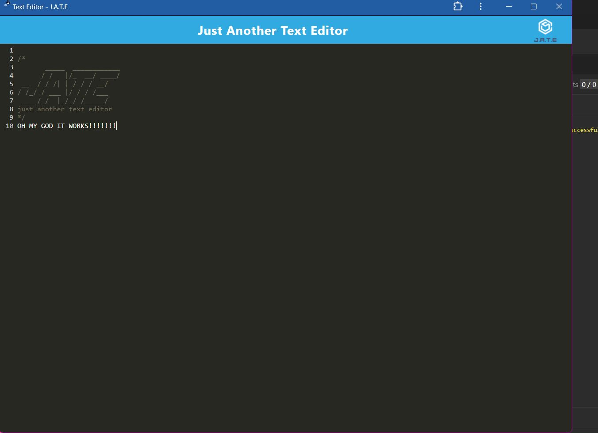
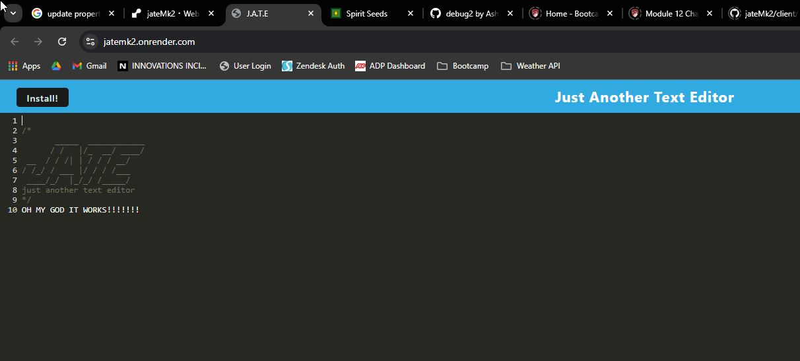

# JATE: Just Another Text Editor

## Description

This is a very simple application, but requires a number of elements in order to function. This app is designed as a PWA, which means that users can use it on or offline, and it will write to the same database.

What did I learn? Never change the file structure of starter code. We'll get to that.
What else did I learn? I'm so glad PWA is out of the curriculum for all the poor schmucks to follow me. It's so badly deprecated that even doing this project late meant I had to do a whole bunch of weird revisions. And to be fair, I never actually once got this to work correctly on my local machine. But it works for you, dear user, so enjoy!

## Table of Contents (Optional)

- [JATE: Just Another Text Editor](#jate-just-another-text-editor)
  - [Description](#description)
  - [Table of Contents (Optional)](#table-of-contents-optional)
  - [Installation](#installation)
  - [Usage](#usage)
  - [Credits](#credits)
  - [License](#license)

## Installation

You don't have to do anything to install this app. Unless you want it to run locally, in which case, click the "Install" button. Doing so will ensure that you don't have any issues with the app even without internet connectivity.

## Usage

Simply navigate to [https://jatemk2.onrender.com](https://jatemk2.onrender.com). Use this app to keep track of notes. Install it locally using the "Install" button if you're worried about connectivity. Make a note, and close it when you're done. Don't worry, the note will still be there for you when you fire it back up. Worried about notes getting lost? Fear not. Install it locally. Notes you make  will still be there for you when you're back  and vice versa.

## Credits

This PWA was created by [Chris Baumgart](https://github.com/cbaumgart004) You'll notice that this is MK2. It turns out, if you take someone else's starter code and decide to change the file structure Willy Nilly, it may be nearly impossible to resolve. At which point you might have to start from scratch. The original repo can be found [here](https://github.com/cbaumgart004/Text-Editor). I figured it would be a good way to look through commits and see the original process.
That said, thanks to [Ash Corse](https://github.com/AshLCorse) for being moral support and giving me a codebase to at least review while troubleshooting. In the end it was the instructor who found a workaround to the super stodgy deprecated code packages, but I couldn't have gotten it done without him. Thanks [Jay Mascarenas](https://github.com/jaymascarenas/)

## License

This project is licensed with an MIT license and can be viewed [here](https://github.com/cbaumgart004/jateMk2/blob/main/LICENSE)
